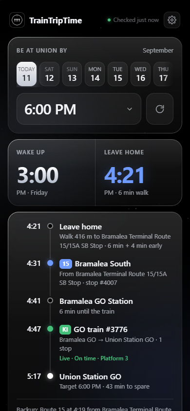
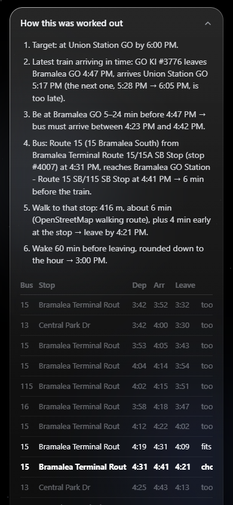
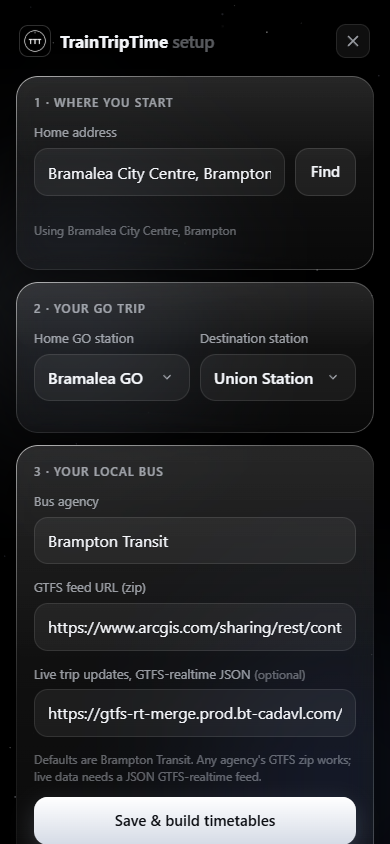
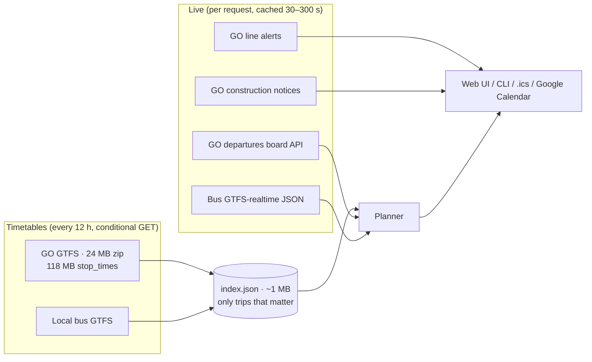

<p align="center">
  
</p>

<h1 align="center">TrainTripTime</h1>

<p align="center">
  <b>Tell it when you need to be downtown. It tells you when to wake up.</b><br>
  A self-hosted commute planner for GO Transit riders that works backwards from your arrival time<br>
  through a live GO train schedule and your local bus — and shows its work.
</p>

<p align="center">
  <a href="https://shreywy.github.io/TrainTripTime/">Project page</a> ·
  <a href="#run-it">Run it</a> ·
  <a href="#how-it-works">How it works</a> ·
  <a href="#engineering-notes">Engineering notes</a>
</p>

<p align="center">
  
  
  
</p>

---

## Why

Getting to class meant checking three things every morning: the GO train timetable, the local
bus schedule, and whether GO had cut service for construction that day. Trip planners optimise for
*leaving now*; I needed the opposite — *"I have to be at Union by 12:00, so when do I wake up?"* —
with my own rules baked in (be on the platform 5 minutes early but not 25, walk to the stop a few
minutes early, prefer route 23).

## What it does

- **Works backwards from an arrival time.** Picks the latest train that gets you there, the bus that
  lands you at the station inside your preferred window, when to leave, and when to wake up.
- **Shows its work.** Every plan comes with the reasoning, every bus and train it considered and why it
  rejected them, and the exact feed versions it used.
- **Checks what's actually happening.** Live GO departure status (on time / delayed / cancelled,
  platform), live GO line alerts, live local-bus predictions, and GO construction notices — filtered to
  the week you're planning.
- **Knows when there's no train.** Weekend construction short-turns are detected from the timetable
  itself and reported as "no routes found", with the closest alternative.
- **One-tap calendar.** Adds a Google Calendar event that starts at the moment you need to leave home.
- **Setup for anyone.** A setup page geocodes your address, lists GO stations, takes any agency's GTFS
  feed, and lets you pick and prefer the bus routes you'd actually ride.
- **Installs like an app.** PWA manifest and icons, designed mobile-first for "Add to Home Screen".

## Run it

Python 3.10+. No packages, no build step.

```bash
git clone https://github.com/shreywy/TrainTripTime.git
cd TrainTripTime
python server.py            # http://localhost:8765 → redirects to /setup on first run
```

Plan from the terminal too:

```bash
python cli.py 2026-09-14 12pm
python cli.py tomorrow 9:30 --json
```

### On a Raspberry Pi (idle = 0 MB)

```bash
sudo cp deploy/commute-tool.socket deploy/commute-tool.service /etc/systemd/system/
sudo systemctl daemon-reload && sudo systemctl enable --now commute-tool.socket
```

systemd holds port 8765 and only starts the app when someone opens it; the app exits after 10 idle
minutes. Edit `User=`/`WorkingDirectory=` in the service file for your machine.

## How it works



**The planning algorithm** (`commute/planner.py`), for arrival target *T*:

1. From the service calendar for that date, take GO trips that stop at the home station and later at the
   destination; pick the latest one arriving by *T*, skipping any the live board reports cancelled.
2. For that train's departure *d*, collect bus trips that board near home and reach a stop near the
   station, arriving in `[d − max_wait, d − platform_buffer]`.
3. Rank candidates in tiers — preferred route in window → preferred route slightly early → any route in
   window → anything that still makes it — and within a tier choose the one that lets you leave home
   latest (walk time comes from OpenStreetMap routing, with per-stop overrides).
4. Leave = bus departure − walk − stop buffer. Wake = leave − prep, optionally floored to the hour.
5. If no bus works, step back to the previous train and try again.

## Engineering notes

- **Zero dependencies, runs on a Pi.** Standard library only: `http.server`, `csv`, `zipfile`,
  `urllib`, `zoneinfo` (with a hand-rolled Ontario DST fallback for Windows builds that ship without
  tz data).
- **118 MB → 1 MB.** The GO feed is streamed row by row with `csv.reader`; only trips touching the two
  stations are kept, and GO buses (most of the feed) are recovered with a second targeted pass instead
  of being held in memory. Peak memory on the Pi went from ~160 MB to ~100 MB, and the resulting
  index is all a request ever reads.
- **Socket activation + idle exit.** The server can adopt a listening socket from systemd
  (`LISTEN_FDS`), rebuilds timetables in a short-lived `nice`d child process so the peak is returned to
  the OS, and shuts itself down when idle. On a shared 1 GB Pi it costs nothing until someone opens it.
- **Live data without API keys.** Live GO departures and alerts come from the same public endpoints
  gotransit.com's departure board calls; GO's construction notices are read from the page's embedded
  Next.js data; bus predictions come from the agency's GTFS-realtime JSON. Every live source is
  cached briefly and fails soft — a plan never breaks because a feed is down.
- **Timetable-derived service changes.** Short-turned trains (e.g. weekend construction ending at
  Mount Dennis) are detected by checking whether a trip from the home station ever reaches the
  destination, rather than by parsing announcements.
- **Human-readable notices, machine-filtered.** Notice text like *"Sept. 11, 14-18 and 21-22"* is
  parsed into dates so only notices affecting the selected week are shown.
- **UI.** Vanilla JS, no framework. Liquid-glass cards use an SVG displacement map generated per card
  on a canvas and applied through `backdrop-filter` where supported (Chromium), falling back to blur on
  Safari. Scroll-snapped day strip with pointer-drag for mouse users.

## API

| Endpoint | |
| --- | --- |
| `GET /api/plan?date=YYYY-MM-DD\|today\|tomorrow&arrive=12pm` | Plan with legs, reasoning, candidates, live status |
| `GET /api/plan.ics?...` | Same plan as an iCalendar file with alarms |
| `GET /api/status` | Feed freshness, build state |
| `GET/POST /api/config` | Read / update settings (used by `/setup`) |
| `GET /api/stations`, `/api/geocode?q=`, `/api/routes` | Setup helpers |
| `POST /api/refresh` | Force a timetable re-download |

## Project layout

```
commute/
  gtfs.py            feed download + streaming index build
  planner.py         the backwards-planning algorithm
  realtime.py        live GO + bus data, notice parsing
  calendar_export.py .ics and Google Calendar links
  tz.py              Toronto time without tzdata
server.py            HTTP server, socket activation, idle exit
cli.py               terminal planner / index builder
static/              UI (index.html, setup.html, app.css, sky.js)
deploy/              systemd socket + service units
examples/            sample config used for the screenshots
```

## Configuration

`config.example.json` holds defaults; your setup is written to `config.json` (gitignored). Notable
knobs: `rules.platform_buffer_min`, `rules.max_platform_wait_min`, `rules.stop_buffer_min`,
`rules.wake`, `bus.preferred_routes`, `bus.allowed_routes`, `bus.walk_overrides_min`.

The server has no authentication — it's meant for your own machine or a private network (e.g. behind
Tailscale). Anyone who can reach it can change its settings.

Google Calendar links can't carry reminders; set your calendar's default notification (e.g. 15 min) and
the event, which starts at your leave-home time, will use it.

## Data

GO Transit schedule data © Metrolinx, used under the Metrolinx Open Data licence. Brampton Transit data
© City of Brampton, via its open data portal. Walking routes © OpenStreetMap contributors. This project
is not affiliated with Metrolinx or any transit agency; always double-check before you travel.

## License

MIT
